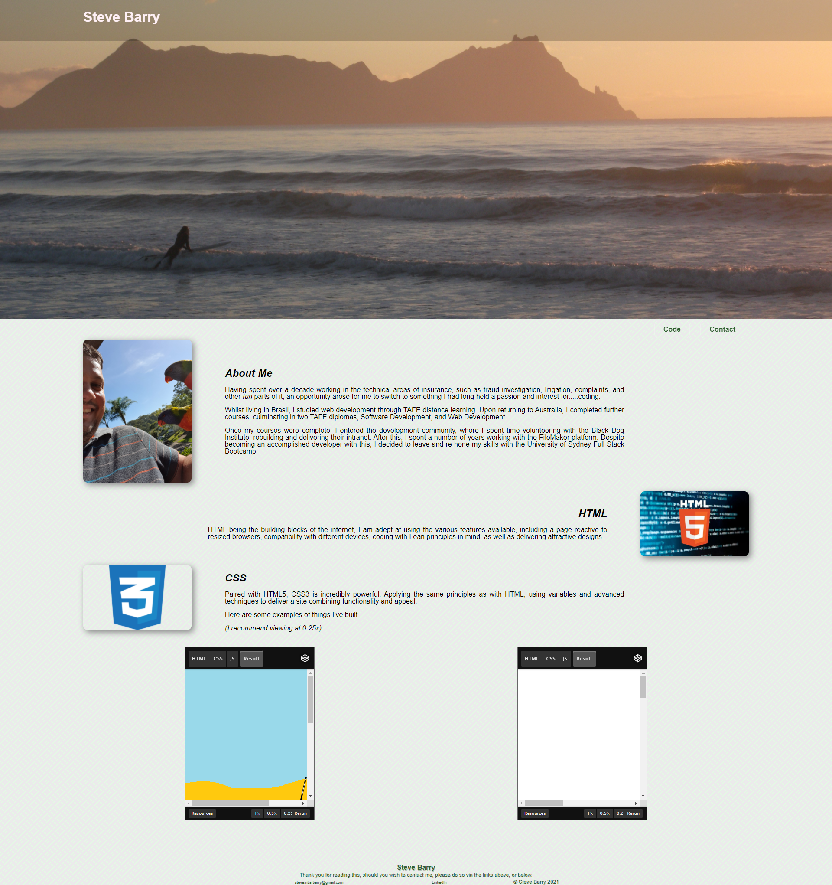

# Homework - Week 2 - Portfolio

## Portfolio - Steve Barry

##  The Task

The task for this week was to create a portfolio to demonstrate our skills with the things we've learnt through the course to date.

### ⭐ ⭐ S.T.A.R. ⭐ ⭐

**SITUATION**

The provided user story was: 

> AS AN employer
> 
> I WANT to view a potential employee's deployed portfolio of work samples
>
> SO THAT  I can review samples of their work and assess whether they're a good candidate for an open position

**TASK**

Developing an online portfolio to showcase my work and my capabilities to recruiters.

**ACTION**

* Structure
  * *A logically built page*
  * *Reactive to various browser sizes and devices*
  * *Correctly functioning links*
* CSS
  * *Attractive layout*
  * *Correctly adjusting to different screen sizes*
  * *Demonstration of existing projects*
  * *Alternative text added for all images*
* IMAGES
  * *Image of self* 
  * *Suitable images*
* Javascript
  * *Correctly working example of javascript and functions*
  * *Use of variables, arrays, and successful handling of them*
* GIT
  * *Numerous commits to track changes in code*
  * *Code added to public repository and Github Pages for public viewing*

**RESULT**

The resulting page has been built, demonstrating use of all required features, however some parts of the User Acceptance Criteria have not been met, or have been achieved in principle, without meeting the stipulated requirement.

* GIVEN I need to sample a potential employee's previous work
* ~~WHEN I load their portfolio~~
* ~~THEN I am presented with the developer's name, a recent photo or avatar,~~
* ~~and links to sections about them, their work, and how to contact them~~
* ~~WHEN I click one of the links in the navigation~~
* ~~THEN the UI scrolls to the corresponding section~~
* ~~WHEN I click on the link to the section about their work~~
* ~~THEN the UI scrolls to a section with titled images of the developer's * applications~~
* WHEN I am presented with the developer's first application
* THEN that application's image should be larger in size than the others
* WHEN I click on the images of the applications
* THEN I am taken to that deployed application
* ~~WHEN I resize the page or view the site on various screens and devices~~
* ~~THEN I am presented with a responsive layout that adapts to my viewport~~

##  The Outcome

You can view the finished product [HERE](https://nbs5000.github.io/wk2_homework/)

Alternatively, here is a screenshot:

> 

---

Written by Steve Barry - Due date 9/12/2021

© 2021 Trilogy Education Services, LLC, a 2U, Inc. brand. Confidential and Proprietary. All Rights Reserved.

